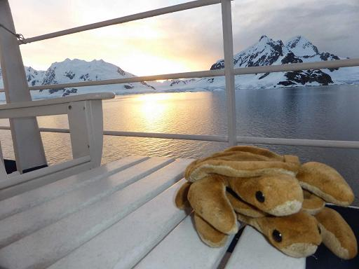

Some things we like to do are:
- Drive down roads
- Think 'bout pancakes

---

<article id="one" class="post style1">
  

    
  

  

    

      <header>
        <h2><a href="generic.html">Paradise Bay</a></h2>
        
Jan 2014 by <a href="#">Tort</a>

      </header>
      
Antarctica!

      <ul class="actions">
        <li><a href="generic.html" class="button alt">Read More</a></li>
      </ul>
    

    

      <a href="#" class="prev disabled"></a>
      <a href="#two" class="scrolly next"></a>
    

  

</article>

---

<!--

-->

<!--
  <ul>
    
      <li>
        <a href="{{ post.url }}">{{ post.title }}</a>
        {{ post.excerpt }}
      </li>
    
  </ul>
-->

[Github repository](https://github.com/jaypalexa/tortandjoie) for this site.

See more turtle goodness [on TurtleGeek.com](http://www.turtlegeek.com).

