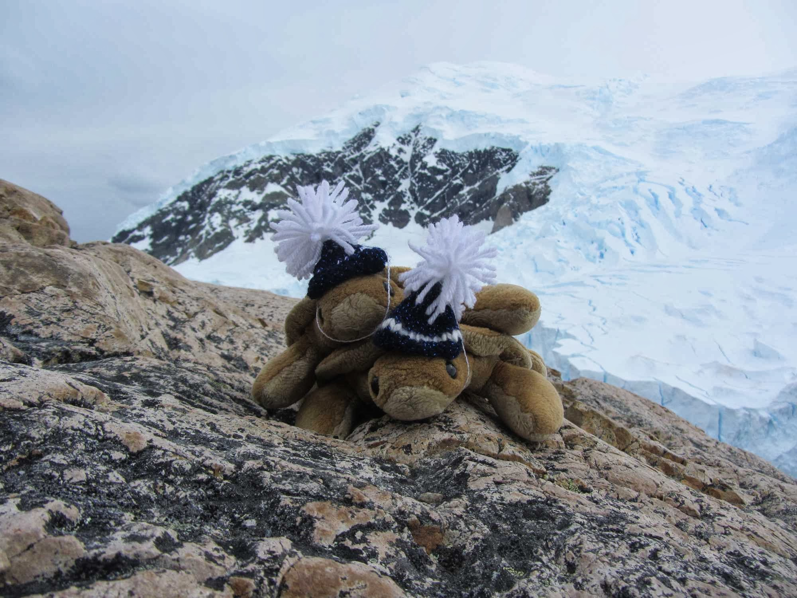

<section id="one" class="wrapper style1">
  

    <article class="feature left">
      
      

        <h2>Helping the Elderly and Terminally Ill...and Their Pets</h2>
        
<strong>Tort writes:</strong> Thanks to your fireage finding efforts, another milestone has been reached. We have donated $100.00 to <a href="http://www.cinnamon.org.uk/">The Cinnamon Trust</a> – the National Charity for the elderly, terminally ill and their pets.

        
Cinnamon Trust is the only specialist national charity which seeks to relieve the anxieties, problems, and sometimes injustices, faced by elderly and terminally ill people and their pets, thereby saving a great deal of human sadness and animal suffering.

        
Who are your constant companions?

        
P. S.  FIRE THE FIREAGE!!!

      

    </article>
    <article class="feature right">
      
      

        <h2>Seven Continents for Two Turtles</h2>
        
<strong>Tort writes:</strong> Joie and I accompanied Mommy and Daddy on their trip to Patagonia and Antarctica.

        
We saw many cool things and made a few new friends.

        
Eric made us wear toques.

        
We have been on all seven continents.  Now we can just nap.

        
What’s on your bucket list?

        
P. S.  FIRE THE FIREAGE!!!

      

    </article>
  

</section>
---
[Github repository](https://github.com/jaypalexa/tortandjoie) for this site.
See more turtle goodness [on TurtleGeek.com](http://www.turtlegeek.com).
