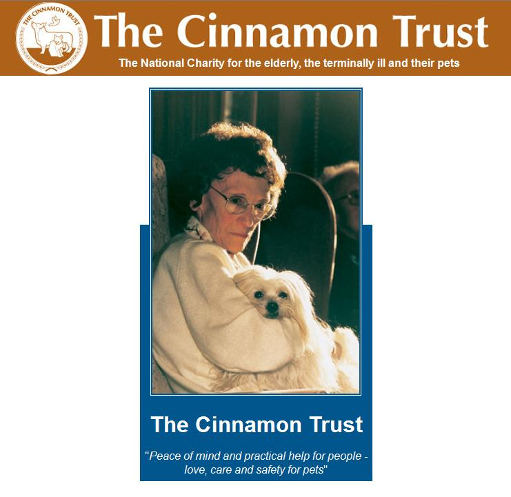
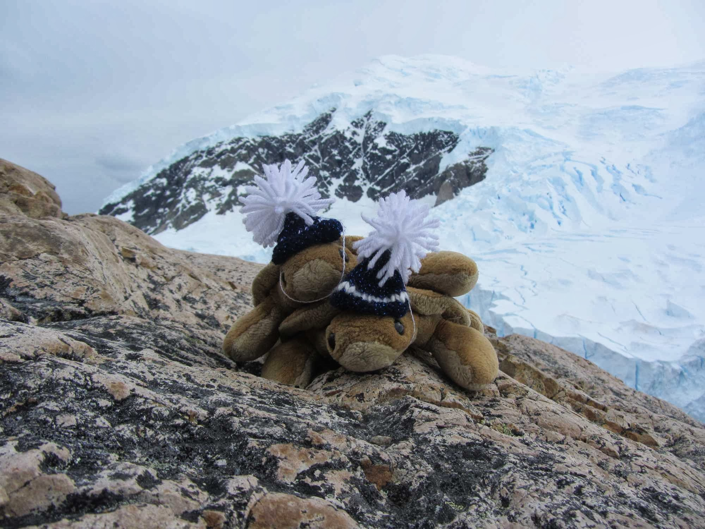
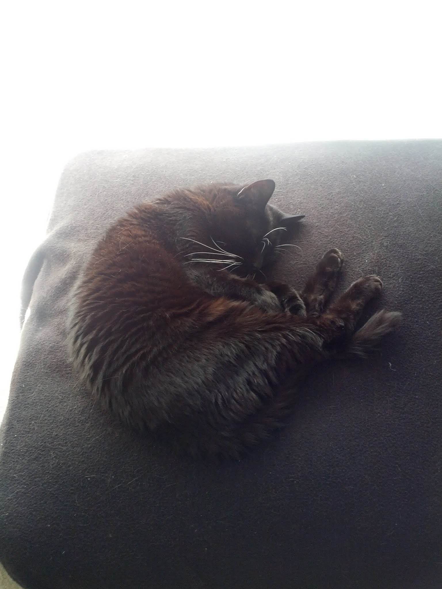
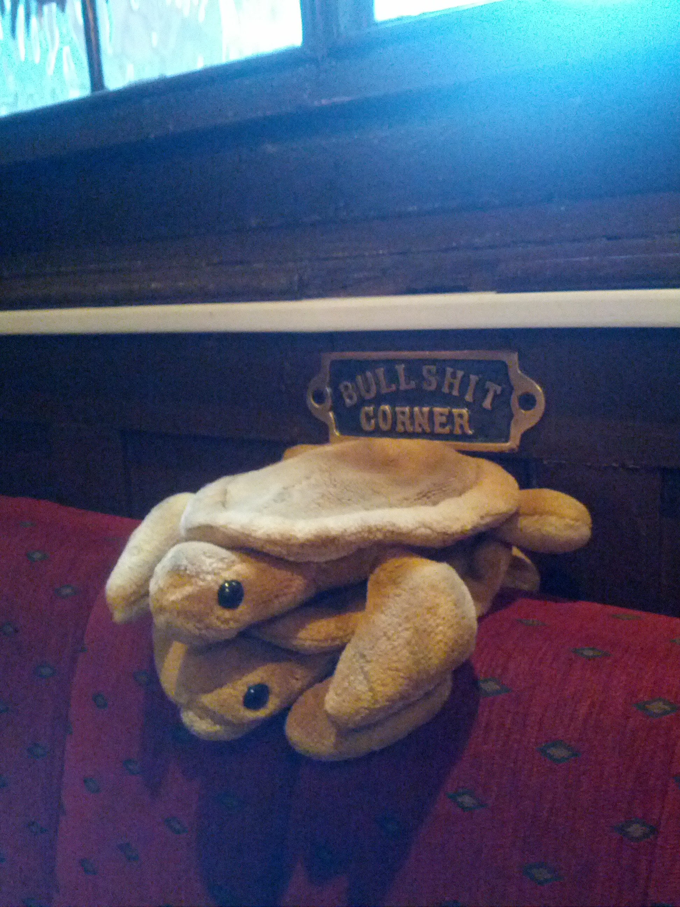
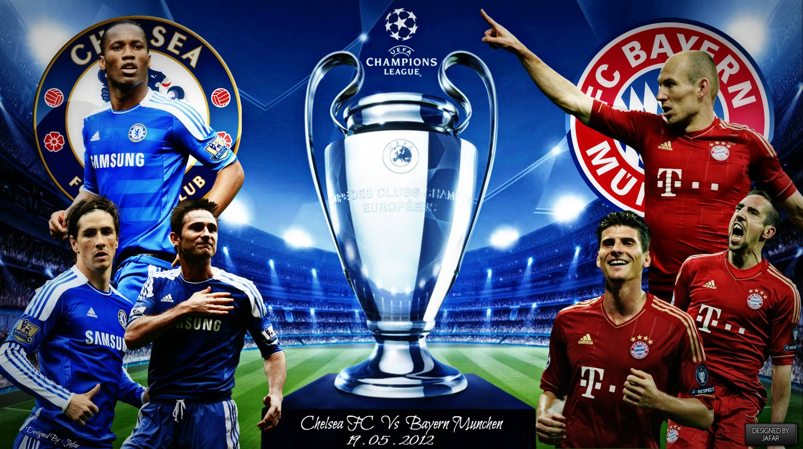
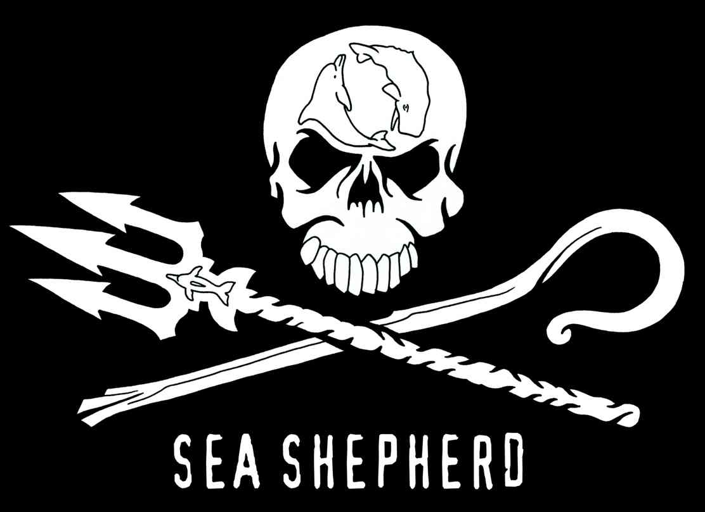

<section id="one" class="wrapper style1">
  

    <article class="feature left">
      
      

        <h2>Helping The Elderly And Terminally Ill...And Their Pets</h2>
        
<strong>Tort writes:</strong> Thanks to your fireage finding efforts, another milestone has been reached. We have donated $100.00 to <a href="http://www.cinnamon.org.uk/">The Cinnamon Trust</a> – the National Charity for the elderly, terminally ill and their pets.

        
Cinnamon Trust is the only specialist national charity which seeks to relieve the anxieties, problems, and sometimes injustices, faced by elderly and terminally ill people and their pets, thereby saving a great deal of human sadness and animal suffering.

        
Who are your constant companions?

        
P. S.  FIRE THE FIREAGE!!!

      

    </article>
    <article class="feature right">
      
      

        <h2>Seven Continents For Two Turtles</h2>
        
<strong>Tort writes:</strong> Joie and I accompanied Mommy and Daddy on their trip to Patagonia and Antarctica.

        
We saw many cool things and made a few new friends.

        
Eric made us wear toques.

        
We have been on all seven continents.  Now we can just nap.

        
What’s on your bucket list?

        
P. S.  FIRE THE FIREAGE!!!

      

    </article>
    <article class="feature left">
      
      

        <h2>Flying Over A Sea Of Tuna</h2>
        
<strong>Tort writes:</strong> P-nut is gone now.  He gave and received very much love.

        
He was Mommy’s sick buddy, Daddy’s work-at-home lap buddy, and everyone’s Little Guy.

        
And those whiskers?  Ridiculous.

        
Joie and I miss him desperately.

        
Daddy hopes he is forgiven.

        
Please raise a glass to the ‘nutter.

        
Who is your buddy?

        
P. S.  FIRE THE FIREAGE!!!

      

    </article>
    <article class="feature right">
      
      

        <h2>Bullshit Corner</h2>
        
<strong>Tort writes:</strong> Sometimes we like to go to our favorite place in Daddy’s mind, grab a pint, and just sit and ponder.

        
Where do you do your thinking?

        
P. S.  FIRE THE FIREAGE!!!

      

    </article>
    <article class="feature left">
      
      

        <h2>Another Day, Another Downer</h2>
        
<strong>Tort writes:</strong> Congratulations to all you long-suffering Chelsea football fans.

        
Your club won the 2012 UEFA Champions League after another season of player mutiny and other Abramovich-inspired drama.

        
Another rich, obsessive, tyrant d-bag grabs a shiny new toy for his pram.

        
I haven’t had the best run of “my team” winning much of anything lately.

        
Not sure why I invest in these sports soap operas.

        
Maybe it is time to pursue other interests.  Such as pancakes.  Except Daddy is on a diet.  Grr.

        
Are <i>your grapes</i> sour?

        
P. S.  FIRE THE FIREAGE!!!

      

    </article>
    <article class="feature right">
      
      

        <h2>Helping To Save The Galapagos</h2>
        
<strong>Tort writes:</strong> Thanks to your fireage finding efforts (special props to Ryan for her recent UK campaign), another milestone has been reached.

        
We have donated $100.00 to the Sea Shepherd – Defending Galapagos project.

        
Those guys get a little up-in-your-grill, but we gotta lend a flipper to our land-based cousins, including Lonesome George.

        
What do you like to defend?

        
P. S.  FIRE THE FIREAGE!!!

      

    </article>
  

</section>
